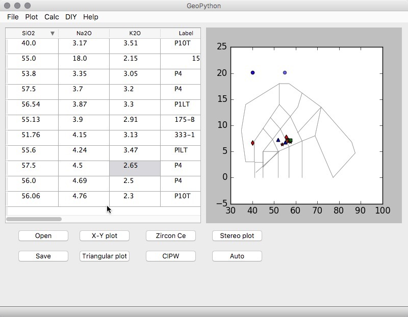

Title: GeoPython，用于地质学的日常工作的 Python 工具集
Date: 2016-12-18 16:20
Category: Python

# [GeoPython，用于地质学的日常工作的 Python 工具集](https://github.com/chinageology/GeoPython)


##### author: cycleuser

##### email: cycleuser@cycleuser.org

##### Copyright 2017 cycleuser


##### 我们的QQ群： 560675626

|进度|日期|新功能|
|--|--|--|
|开始功能积累|2016-07-07 6:20|TAS|
|增加 QAPF|2016-07-09 08:32|QAPF|
|增加吴尔夫网和施密特网|2016-12-18 08:32|Wulf|
|全部功能重构|2017-03-15 15:30|Pearce and  Harker|
|单个锆石 Ce 计算|2017-03-25 15:30|Ballard|
|多个锆石 Ce 计算|2017-03-28 15:30|MultiBallard|
|多样品CIPW计算|2017-04-3 12:30|MultiCIPW|
|新图形界面|2017-07-23 12:30|基于 PyQt5 构建新图形界面|


##简介


GeoPython 是一个将 Python 用于地质学的日常工作的计划。这是一套自由软件：你可以重新分发或者做出修改，但必须基于由自由软件基金会发布的GNU通用公共许可证第三版的许可,或其后的版本。


## 全新图形界面！



我正在制作一个新的图形界面，不过目前还在开发中。

这个图形版本的源代码都在 [NewGUI](/NewGUI) 这个文件夹里面。

Only a few functions are available for now, at the moment I am typing here there is only TAS and not even a whole good TAS function.

目前实现的功能还很少，只是搭建了大概的轮廓： open 按钮点击选择数据文件，载入数据之后，可以在表格试图中排序和修改，并且可以通过 save 按钮来保存；右侧的图只是能显示出来而已，细节都还没顾得上，特别粗糙。

开发进度确实挺慢的，在此对大家表示歉意。

首先是由于我去年年底到今年年初的肿瘤手术以及身体恢复状况不佳；其次一个更重要的原因是去年我押宝 Kivy 的决定现在看来很愚蠢，因为 Kivy 虽然跨平台开发挺有趣，但是稳定性和可靠性比较坑。所以我从头学习了一点点 PyQt5，作为图形框架来继续 GUI 的开发。

目前功能太简陋，但是希望大家给我一点时间，耐心围观一下什么的。我相信美好的事情终究会发生。

## [下载链接](https://github.com/chinageology/GeoPython/blob/master/Download.md)

## 依赖关系

GeoPython 是在 Python 3.5 下写的，基于 numpy， matplotlib， xlrd 以及 pandas。所以这几个包你都得安装。

用PIP就可以安装了：

```Python
pip install numpy
pip install matplotlib
pip install pandas
pip install xlrd
```

## 在Windows系统中使用

如果你在使用 Windows7 操作系统，可能会出现`api-ms-win-crt`无法定位这样的错误，所以先要安装 KB2999226 这个补丁，然后安装 `Visual C++ Redistributable 2015`。
当然，我已经把这部分打包了，[32位操作系统下载](https://pan.baidu.com/s/1kVwSQ95)，[64位操作系统下载](https://pan.baidu.com/s/1qY34ocW)。

我已经将程序功能打包成了一个单独的 zip 包，内置了 exe 文件和 使用的 数据文档样本。下载 Windows 版本的 zip 文件，解压缩之后，把你的数据按照示范放到对应的模板文件中，然后运行 exe，选择对应的按钮来点击一下就可以了。


## OS X 系统中使用


苹果系统用户下载 OSX 版本的 zip 文件然后解压缩出来一个 App 文件，到APP文件所在同一目录，打开你要用的 Excel 文件，输入数据进去，然后双击这个 App 文件，就能用了。生成的图像跟数据文件一样，也在 App 文件所在目录。


## 在 Python 中使用

推荐在 Python 中使用，这样可以使用到最新的开发版本，体验到全部最新的功能。安装方法很简单，使用 pip 即可：


```Bash
pip install geopython
```

然后打开你的python，进入到数据目录，目前样本数据文件还要在[这里](https://github.com/chinageology/GeoPython/blob/master/DataFileSamples.zip)下载。下载好样本文件，把自己的数据填入，然后用下面的命令就可以运行了：

```Bash
ipython
```

```Python
import geopython as gp

gp.Tas("tas.xlsx").read()               # TAS 图解
gp.Ree("ree.xlsx").read()              # REE 稀土元素图解
gp.Trace("trace.xlsx").read()              # 微量元素蛛网图
gp.Trace2("trace.xlsx").read()              # 另一种组合的微量元素蛛网图
gp.Qfl("qfl.xlsx").read()              # QFL 大地构造图解
gp.Qmflt("qmflt.xlsx").read()              # Qmflt 大地构造图解
gp.QapfP("qapf.xlsx").read()              # Qapf 图解，适用于深成岩
gp.QapfV("qapf.xlsx").read()              # Qapf 图解，适用于喷出岩
gp.Polar("strike.xlsx").read()              # 构造产状的吴尔夫网和施密特网投图
```

一定记得，只有先导入了模块，才能使用里面的功能。

导入完毕后，根据我提供的样板文件，把你的数据输入进去。

如果python提醒你找不到excel的xlsx文件，很可能就是你进错目录了，那样你就需要找到你下载并修改的xlsx文件的位置，用cd命令进去，然后再进行上面的操作。

然后你就在程序中如下所示这样读取一下，然后用对应模块的函数帮你搞定一切了。（注意大小写！）

如果你的数据文件没有什么问题，你就能得到图像了，这些图像会存放在excel表格文件所在的同一目录下：

* 一个碉堡的 svg（一种矢量图）文件，直接就能用Adobe Illustrator 或者 Corel Draw来打开编辑。

* 然后就是一个png图像了。


